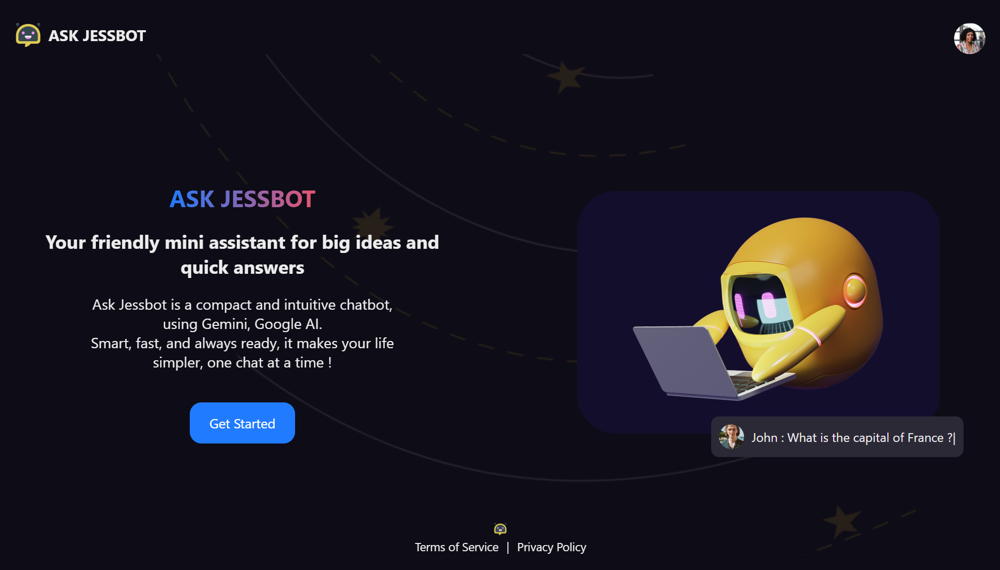
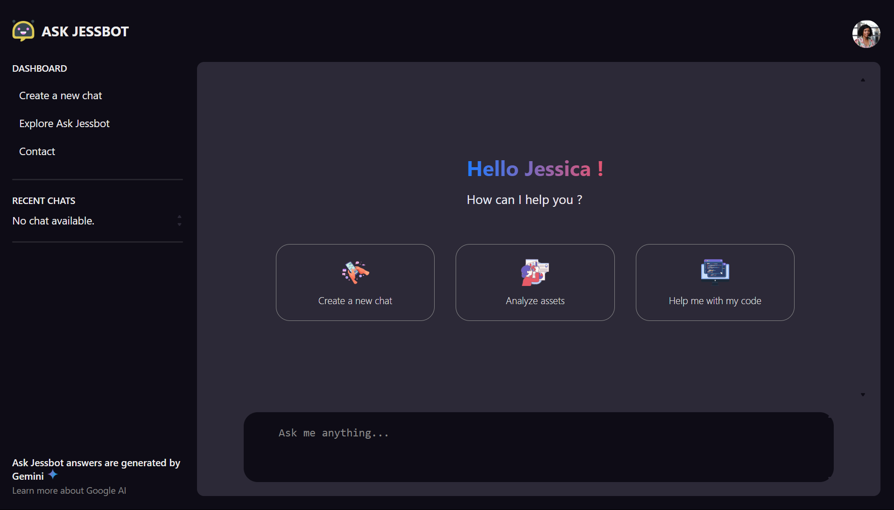

# ai-chatbot

This project is a chatbot application created with React, Node.js, Express.js and MongoDB, using Google Gemini AI Model (Gemini 2.5 Flash).

## Table of Contents

- [Demo](#demo)
- [Stack](#stack)
  - [Frontend](#frontend)
  - [Backend](#backend)
- [Screenshots](#screenshots)
- [Main features](#main-features)
- [Create a MongoDB database](#create-a-mongodb-database)
- [Run the project locally](#run-the-project-locally)
- [Contributing](#contributing)
- [Stay Updated](#stay-updated)
- [Contact](#contact)
- [License](#license)

## Demo

You can see a live demo of the project [here](https://www.ai-chatbot.jesselessa.dev/).

## Stack

### Frontend

- The user interface was created with **React** using **Vite** tool for rapid development.

- Client-side data requests, intelligent caching, and loading/error state management were handled using **TanStack Query**.

- The application navigation was managed by **React Router**.

### Backend

- The API was built with **Node.js** and **Express**.

- The database was created with **MongoDB**.

## Screenshots

## Main features

- User authentication with **Clerk** [(https://clerk.com)](https://clerk.com), an authentication platform providing login via passwords and social identity providers.
- Creation/Deletion of a chat with the AI.
- Image upload managed by **ImageKit** [(https://imagekit.io)](https://imagekit.io).
- AI response generated from text-only input or text-and-image input, using **Google Gemini API** [(https://ai.google.dev/gemini-api/docs)](https://ai.google.dev/gemini-api/docs).

## Create a MongoDB database

Before running the project locally, you will need to set up your MongoDB database, following these steps :

### 1. Create a MongoDB Atlas account

MongoDB Atlas provides an easy way to host and manage your data in the cloud [(https://www.mongodb.com/docs/atlas/getting-started/)](https://www.mongodb.com/docs/atlas/getting-started/).

### 2. Use one of MongoDB Atlas methods

There are three methods provided by MongoDB Atlas to create a database : using the UI (User Interface), the Shell (mongosh), or using Compass, the MongoDB GUI.

## Run the project locally

After setting up your database, you can run the project locally by following these steps :

1.  Open your terminal and navigate to the location where you want the local repository to be copied.
2.  Clone the repository : `git clone https://github.com/jesselessa/ai-chatbot.git`.
3.  Navigate to the project directory : `cd ai-chatbot`. The latter is composed of two folders : `client` and `backend`.
4.  Copy the `.env.example` files from both the `client` and `backend` folders, and rename them to `.env` in their respective folders.
5.  Fill in the required values for the environment variables in each `.env` file.
6.  Install the dependencies necessary to the project inside each folder by running `npm install`.
7.  Then :
    - Inside the `client` folder, run the application in development mode : `npm run dev`.
    - Inside the `backend` folder, start the server and launch the database : `npm start`.
8.  Finally, open http://localhost:5173 in your web browser to view the live application.

**Important: Do not commit your `.env` files containing sensitive information (API keys, secrets) to a public repository. Add them to your `.gitignore` file**

## Contributing

Feel free to make improvements, fix bugs, or suggest new features. Contributions are welcome !

- Fork the repository and clone it to your local machine : `git clone https://github.com/jesselessa/ai-chatbot.git`.
- Navigate to the project directory : `cd ai-chatbot`.
- Inside the project directory :
  - Install dependencies by running `npm install`.
  - Create a new branch for your feature or bug fix : `git checkout -b my-feature`.
  - Make your changes and ensure that your code follows the project coding style.
  - Test your changes locally.
  - Commit your changes and push them to your forked repository.
- Finally, submit a pull request to the main repository with a clear description of your changes.

## Stay updated

To stay updated with the project latest changes, you can pull them from the repository : `git pull origin main`.

## Contact

For inquiries, you can contact me via [LinkedIn](https://www.linkedin.com/in/jesselessa/).

## License

This project is licensed under the Creative Commons Attribution-NonCommercial-ShareAlike 4.0 International License (CC BY-NC-SA 4.0).

**You are free to :**

- **Share :** Copy and redistribute the material in any medium or format.
- **Adapt :** Remix, transform, and build upon the material.

**Under the following terms :**

- **Attribution :** You must give appropriate credit, provide a link to the license, and indicate if changes were made. You may do so in any reasonable manner, but not in any way that suggests the licensor endorses you or your use.
- **NonCommercial :** You may not use the material for commercial purposes.
- **ShareAlike :** If you remix, transform, or build upon the material, you must distribute your contributions under the same license as the original.

**No additional restrictions :** You may not apply legal terms or technological measures that legally restrict others from doing anything the license permits.

**Summary :**

This license allows you to use, modify, and share this project for personal, non-commercial purposes, provided you give appropriate credit and share any derivative works under the same license. For commercial use, please contact the author.

For more details, please refer to the full license text at [https://creativecommons.org/licenses/by-nc-sa/4.0/](https://creativecommons.org/licenses/by-nc-sa/4.0/).

---

&copy; 2025, Jessica ELESSA - All rights reserved
